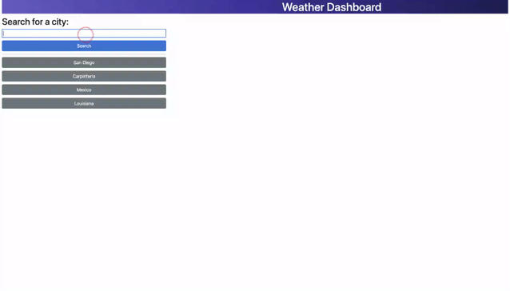

# Module 6 Challenge: Weather Dashboard

## Description

I built a weather dashboard that uses the 5 Day Weather Forecast API to retrieve weather data for cities. Travelers can use this application to see current and future weather conditions for multiple cities.

Click [here](https://sieraford.github.io/apis-weather-dashboard-siera/) to view the application.

## Screenshots

## Installation

N/A

## Usage

When you open the application, you can search for a city. After clicking the "Search" button, you are presented with current and future conditions for that city and that city is added to the search history.

When you view current weather conditions for that city, you are presented with the city name, the date, an icon representation of weather conditions, the temperature, the humidity, and the the wind speed.

When you view future weather conditions for that city, you are presented with a 5-day forecast that displays the date, an icon representation of weather conditions, the temperature, the wind speed, and the humidity.

When you click on a city in the search history, then you are again presented with current and future conditions for that city.

## Credits

N/A

## License

N/A
